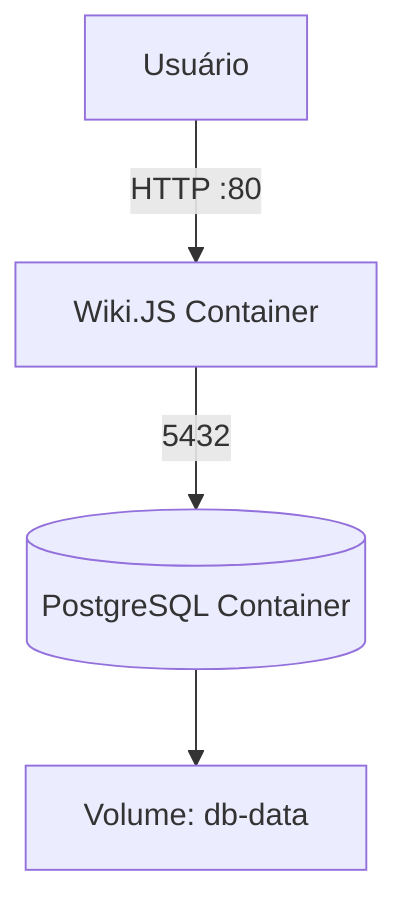

# SEAD Wiki.JS

A base de conhecimento da SEAD.

O objetivo é centralizar informações técnicas, documentações de sistemas, processos internos e boas práticas adotadas pela equipe de tecnologia da SEAD, garantindo fácil acesso e colaboração entre os times.

Este repositório contém a configuração Docker do **Wiki.JS**, a plataforma de **base de conhecimento interna da SEAD (Secretaria de Estado da Administração de Goiás)**.

---

## Estrutura do Projeto

O ambiente é orquestrado via **Docker Compose**, garantindo portabilidade e simplicidade na execução.

## Serviços

| Serviço  | Descrição                                     | Porta     | Imagem               |
| -------- | --------------------------------------------- | --------- | -------------------- |
| **db**   | Banco de dados PostgreSQL utilizado pela Wiki | Interna   | `postgres:11-alpine` |
| **wiki** | Aplicação principal Wiki.JS                   | 80 → 3000 | `requarks/wiki:2`    |

---

## Arquitetura do Ambiente



## Como Executar o Projeto

1. Clone este repositório

```bash
git clone https://codigo.dev.tools.go.gov.br/home-sead/geds/projetos-especiais/wiki-js.git
cd wiki-js
```

2. (Opcional) Configure as variáveis
   Caso deseje alterar as credenciais padrão, edite o docker-compose.yml ou crie um arquivo .env.
3. Suba o ambiente

```bash
docker-compose up -d
```

4. Acesse a Wiki

```bash
http://localhost
```

## Configuração Inicial da Wiki

    1.	No primeiro acesso, crie o usuário administrador.
    2.	Configure o idioma, tema e permissões conforme a necessidade da equipe.
    3.	Defina as integrações (autenticação, e-mail, etc) através do painel administrativo.

### Backup e Restauração do Banco

#### Backup manual do PostgreSQL

Execute o comando abaixo para gerar um dump do banco:

```bash
docker exec -t wiki-js-db pg_dump -U wikijs wiki > backup_wikijs_$(date +%Y%m%d).sql
```

Restauração do backup:

```bash
cat backup_wikijs_20251106.sql | docker exec -i wiki-js-db psql -U wikijs -d wiki
```

### Boas Práticas de Segurança

    •	Alterar as credenciais padrão (wikijs / wikijsrocks) em produção.
    •	Restringir o acesso da porta 80 somente à rede interna, ou configurar proxy reverso (Nginx / Traefik).
    •	Habilitar backup automático diário com agendamento (cron ou GitLab CI/CD).
    •	Manter a imagem sempre atualizada:

```bash
docker pull requarks/wiki:2
docker-compose up -d
```

### Organização da Wiki

A Wiki está organizada em áreas temáticas estratégicas:

    • Arquitetura de Software
    • Infraestrutura e DevOps
    • Documentação de Sistemas
    • Processos Internos
    • Guia de Desenvolvimento SEAD
    • Ambiente e Padronizações

### Tecnologias Utilizadas

    •	Wiki.JS
    •	Docker
    •	PostgreSQL
    •	Mermaid (para diagramas no README)

⸻

### Sobre a SEAD

A Secretaria de Estado da Administração de Goiás (SEAD) tem como missão promover a modernização administrativa e tecnológica do Governo do Estado, apoiando a transformação digital, a gestão de conhecimento e a eficiência dos serviços públicos.
